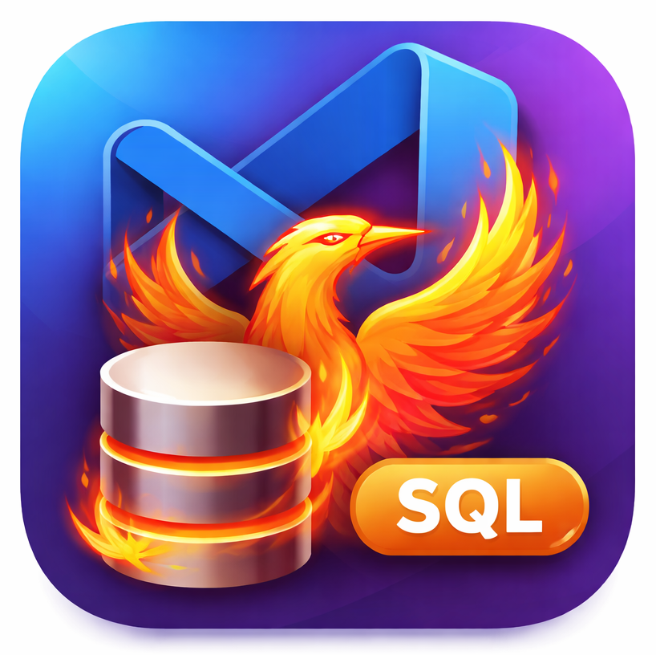

<p align="center">
  
</p>

# Firebird SQL
Firebird database management extension for VS Code, Antigravity, Cursor and other VS Code compatible editors. Take advantage of AI autocomplete features in AI-powered IDEs like Antigravity, Cursor and similar.


## Features

- **SQL Execution**: Run queries (`CTRL+Enter`) and scripts (`CTRL+ALT+Enter`). Supports SQL from other files (e.g. PHP) with parameter injection.
- **Transaction Support**: Explicit Commit/Rollback support.
- **Explorer**: View databases, tables, views, procedures, triggers and more.
- **Table Info**: Detailed view of table structure with PK/FK tags, index column tooltips, and grouped trigger views.
- **Query Results**: Context menu to copy values, columns, or entire tables (Excel-formatted) to clipboard.
- **Object Search**: Quickly filter and find database objects.
- **Object Management**: Create and manage tables, views, procedures, triggers, indexes, etc.
- **Backup & Restore**: Easily backup and restore your connection settings, including favorites and scripts.

## Requirements

- Firebird server access
- VS Code (or compatible like Antigravity, Cursor) 1.80.0 or higher

## Keyboard Shortcuts

- `CTRL+Enter`: Run query
- `CTRL+ALT+Enter`: Run script
- `CTRL+SHIFT+Backspace`: Close query result
- `Ctrl+Alt+Shift+C`: Commit Transaction
- `Ctrl+Alt+Shift+R`: Rollback Transaction

## Basic Usage

1. **Select Firebird**: Click on the Firebird icon in the Activity Bar.
2. **Create Connection**: Click the `+` button in the "Databases" view to add a new connection to your Firebird database (`.fdb` file).
3. **Open SQL File**: Open a file with the `.sql` extension.
4. **Run Query**: Write your SQL query and press `CTRL+Enter` (or `CMD+Enter` on macOs) to run the query or press `CTRL+ALT+Enter` to execute complex scripts with multiple statements (DDLs)
5. **View Results**: The results will be displayed in a separate panel.

## Advanced Usage

### SQL Execution in Source Code (Parameter Injection)

You can execute SQL queries directly from within source code files (PHP, Python, etc.). Use comments to inject values for parameters (`?` or `:name`) using `--@val=...`, `--@value=...`, or `/*@val=...*/`.

**Example:**
Place the cursor inside the SQL string (or highlight the query) and press `CTRL+Enter`.

```php
$sql = "
    SELECT
        id
    FROM PRODUCTS
    WHERE
        category=? --@val='others'
        and type=? --@val=1
        AND createAt>? /*@val='2026-01-01'*/
        AND status=:status -- @value='ACTIVE'
    ;
";
```
**Configuration:**
- Add the language identifier (e.g., "php") to `firebird.allowedLanguages` in VS Code settings to enable this feature for those files.
- Use `firebird.enableCodeLensInNonSqlFiles` (default: `false`) to control whether CodeLens should be displayed in these files.
