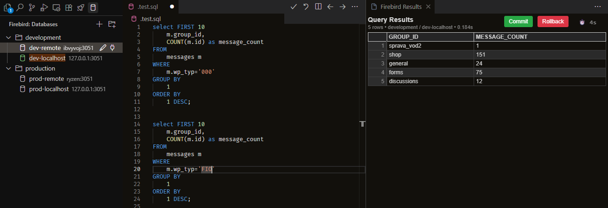

# Firebird for VS Code

Firebird database management extension for VS Code.

## Features

- **Explorer**: View databases, tables, views, procedures, triggers and more.
- **SQL Execution**: Run queries (CTRL+Enter) and scripts (CTRL+ALT+Enter).
- **Transaction Support**: Explicit Commit/Rollback support.

## Requirements

- Firebird server access
- VS Code 1.80.0 or higher

## Usage

1. **Select Firebird**: Click on the Firebird icon in the Activity Bar.
2. **Create Connection**: Click the `+` button in the "Databases" view to add a new connection to your Firebird database (`.fdb` file).
3. **Open SQL File**: Open a file with the `.sql` extension.
4. **Run Query**: Write your SQL query and press `CTRL+Enter` (or `CMD+Enter` on macOs) to run the query or press `CTRL+ALT+Enter` to execute complex scripts with multiple statements (DDLs)
5. **View Results**: The results will be displayed in a separate panel.
